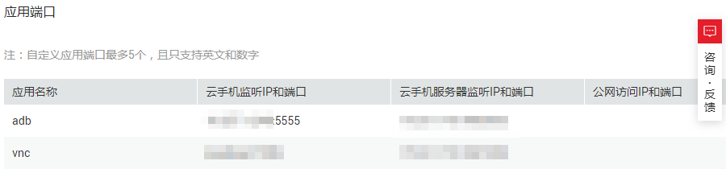
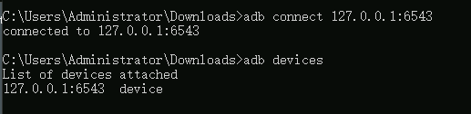

# ADB方式（公网）<a name="cph_ug_0010"></a>

## 前提条件<a name="section13533746254"></a>

-   创建SSH隧道前，需开通公网，并在自己的物理设备上安装SSH客户端服务，比如OpenSSH。
-   已获取项目ID，请参考[如何获取Project ID](#section1827441014428)。
-   请确保您用于和云手机建立连接的本地端口处于空闲状态。

    执行如下命令查看端口占用情况：

    ```
    netstat –an
    ```

    如下图 6667端口又被其他程序占用，而1234端口空闲。

    


## 如何获取Project ID<a name="section1827441014428"></a>

1.  登录管理控制台。
2.  在用户名的下拉列表中，单击“我的凭证”。
3.  在“项目列表”页签中查看项目ID。

## 步骤1 创建SSH隧道<a name="section9258213142515"></a>

1.  登录管理控制台。
2.  在管理控制台左上角单击图标，选择区域和项目。
3.  在服务列表页，选择“计算 \> 云手机”。

    进入云手机页面。

4.  在左侧导航栏，选择“云手机 \> 云手机服务器管理”。
5.  在云手机服务器实例列表，展开任意一台服务器的详情，记录公网IP地址。（试玩手机在左侧导航栏选择“试玩中心”，进入试玩中心页面，单击待访问的云手机实例，记录应用端口中adb一行的“SSH隧道公网IP”。）
6.  <a name="li20629162115356"></a>选择一台云手机服务器，单击右侧操作栏中“修改密钥对“。（试玩手机在左侧导航栏选择“试玩中心”，进入试玩中心页面，单击“密钥对”属性右侧的进行修改。）
7.  选择用于建立SSH隧道的密钥对，单击确定。
8.  在左侧导航栏，选择“云手机 \> 云手机管理”。
9.  在云手机实例列表，选择待访问的云手机实例，单击名称进入详情页面。

    > **说明：**   
    >试玩手机在左侧导航栏选择“试玩中心”，进入试玩中心页面，单击待访问的云手机实例进入详情页面。  
    >如果有多个云手机服务器时，选择“云手机 \> 手机云服务器”确定目标服务器后，单击待访问的云手机实例进入详情页面。  

10. 记录云手机监听的ADB IP和端口。

    **图 1**  云手机监听的ADB IP和端口<a name="fig18732034124920"></a>  
    

    > **须知：**   
    >您需要记录的是“云手机监听IP和端口”，而非“云手机服务器监听IP和端口”。  

11. <a name="li1740315220577"></a>本地机器中，执行如下命令。

    ```
    ssh -L 本地空闲端口:云手机监听IP:云手机监听端口 SSH隧道用户名@公网IP地址 -i 私钥文件路径 -Nf
    ```

    其中，

    -   “本地空闲端口”是您本地机器任一空闲端口，通过该端口映射云手机应用端口。
    -   SSH隧道用户名为[如何获取Project ID](#section1827441014428)获取的Project ID。若该Project ID长于32位，则取前32位作为您建立SSH隧道的用户名。
    -   私钥文件是创建对应密钥对（即步骤[6](#li20629162115356)）时所获得的pem文件。若私钥丢失可新建密钥对并进行替换。

    执行命令后应无返回信息。


## 步骤2 创建ADB连接<a name="section1650324092412"></a>

1.  下载ADB工具。

    访问https://developer.android.com/studio/releases/platform-tools，选择“SDK Platform-tools for Windows”。

2.  下载后得到platform-tools\_r28.0.1-windows.zip文件，解压该压缩文件至您选定的目录（PATH）。
3.  通过命令行工具进入PATH\\platform-tools目录。
4.  执行如下ADB命令，连接本地IP和端口，创建与云手机的ADB连接。

    ```
    adb connect 127.0.0.1:本地空闲端口
    ```

    其中，本地空闲端口为[11](#li1740315220577)中的对应端口。

5.  执行如下命令检查连接设备。

    ```
    adb devices
    ```

    > **说明：**   
    >以上示例针对ADB应用进行举例。  
    >当您通过SSH隧道连接VNC应用时，需将[11](#li1740315220577)中的云手机监听IP替换为“localhost”。当您通过SSH隧道连接除VNC和ADB以外的其他应用时，需将[11](#li1740315220577)中的云手机监听端口需替换为相应应用的端口号。  


## 步骤3 进入手机<a name="section8367448142618"></a>

执行如下命令进入云手机。

```
adb -s 127.0.0.1:本地空闲端口shell
```

执行如下命令：

```
adb devices
```

出现如下提示表示连接成功：



