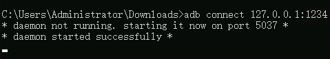

# ADB方式（公网）

通过公网连接云手机实例时，弹性公网IP绑定在服务器上，因此需要先建立SSH隧道，即ADB方式（公网）包括两个步骤：建立SSH隧道；通过ADB连接云手机。关于SSH隧道和ADB的介绍请参见“[基本概念](https://support.huaweicloud.com/productdesc-cph/cph_qs_0004.html#section4)”。

用于连接云手机的设备可以为本地设备，也可以是云上的机器，推荐您使用本地设备。本地设备的操作系统不限，Windows、Linux、Android OS或Mac OS均可，本节操作以Windows系统为例。

## 前提条件

云手机实例状态必须为“运行中”。

## 准备工作

建立SSH隧道前，确保用来连接云手机的本地设备已安装SSH服务（请参见[如何确认本地设备已安装SSH服务？](https://support.huaweicloud.com/cph_faq/cph_faq_0020.html)）。您还需要登录云手机管理控制台，完成如下准备工作：

1.  获取云手机所在区域的项目ID。方法如下：
    1.  在右上角用户名的下拉列表中，选择“我的凭证”。

        

    2.  在“API凭证 \> 项目列表”中，获取待连接的云手机所在区域的“项目ID”。

        以“华东-上海一”为例：

        

        > **说明：** 
        >若项目ID位数多于32位，则取前32位作为建立SSH隧道的用户名。

2.  选择一个本地设备中任意未被占用的端口，用来和云手机建立连接。

    您可以执行**netstat -an**命令，查看端口占用情况：

    如下图，6667端口已被其他程序占用（显示LISTENING），而1234端口空闲。

    

3.  获取云手机监听地址，即云手机的内网IP与端口。方法如下：
    1.  在云手机控制台，选择左侧导航栏的“实例管理”，单击待连接云手机实例的名称，进入详情页面。

        

    2.  在“应用端口”区域获取ADB应用对应的实例监听地址。

        

        > **说明：** 
        >-   如果在购买服务器时，在高级配置中自定义了应用端口，这里会显示这些端口信息。SSH隧道鉴权方式与使用默认的ADB端口一样，只需要将云手机监听地址替换为对应端口的云手机监听地址即可。
        >-   若自定义应用端口时勾选了“公网访问”，则此处会显示对应端口的公网访问地址，用户可以通过公网+此端口的方式直接访问云手机，但要注意安全风险。

4.  获取服务器的公网IP地址。方法如下：

    在云手机控制台，选择左侧导航栏的“服务器管理”，在服务器所在行，获取“IP”参数的取值。

    

    > **说明：** 
    >如果有多台服务器，请根据云手机名称来判断云手机所属服务器是哪一台。例如，云手机名称为cph-test-1-00001，那么对应的服务器名称为cph-test-1。

5.  获取服务器的密钥对对应的私钥文件在本地的保存路径，即[购买云手机实例](购买云手机实例.md)步骤[6](购买云手机实例.md#li1875842514113)中创建密钥对时保存在本地的私钥文件路径，例如：C:\\Users\\Administrator\\Downloads\\KeyPair-a49c.pem。路径不区分大小写，推荐您使用全英文路径。

    > **说明：** 
    >如果服务器的密钥对对应的私钥文件丢失，请参考[私钥文件丢失，怎么办？](https://support.huaweicloud.com/cph_faq/cph_faq_0010.html)。

## 步骤1：建立SSH隧道

1.  在本地设备打开命令提示符窗口，以Windows 10操作系统为例，方法如下：

    同时按下“Win + R”，在打开的“运行”对话框中输入**cmd**，按“Enter”。

2.  执行以下命令，建立SSH隧道。

    **ssh -L 本地空闲端口:云手机监听地址 SSH隧道用户名@公网IP地址 -i 私钥文件路径 -Nf**

    各参数说明及获取方式如下所述：

    -   **本地空闲端口**：用户自由选择的本地设备中任意未被占用的端口，通过该端口映射云手机应用端口。获取方式见[2](#li918704218111)。
    -   **云手机监听地址**：云手机的内网IP与端口。获取方式见[3](#li827525992514)。
    -   **SSH隧道用户名**：云手机所在区域的项目ID。获取方式见[1](#li292753322516)。
    -   **公网IP地址**：服务器的公网IP。获取方式见[4](#li12571818103710)。
    -   **私钥文件路径**：服务器的密钥对对应的私钥文件在本地的保存路径。获取方式见[5](#li5745145662516)。

    假设本地空闲端口为1234，云手机监听地址为10.237.0.61:5555，SSH隧道用户名为05e1aexxx，公网IP地址为xxx.xxx.xxx.xxx，私钥文件路径为C:\\Users\\Administrator\\Downloads\\KeyPair-a49c.pem，命令如下：

    **ssh -L 1234:10.237.0.54:5555 05e1aexxx@xxx.xxx.xxx.xxx -i C:\\Users\\Administrator\\Downloads\\KeyPair-a49c.pem -Nf**

    该命令表示从本地PC建立一个到云手机的SSH隧道，使用本地端口转发模式，监听本地PC的1234端口；访问本地PC的1234端口时，通信数据将会被转发到云手机的5555端口。

    执行命令后，SSH程序会在后台执行隧道的转发，执行后无报错或者报“Authorized users only. All activities may be monitored and reported.”即为SSH隧道建立成功。

    > **说明：** 
    >建立SSH隧道的故障排查，请参考如下链接：
    >-   [通过公网访问云手机时，建立SSH隧道失败了，如何解决？](https://support.huaweicloud.com/cph_faq/cph_faq_0005.html)
    >-   [建立SSH隧道时报错“too open”？](https://support.huaweicloud.com/cph_faq/cph_faq_0008.html)
    >-   [建立SSH隧道时报错“Permission denied”？](https://support.huaweicloud.com/cph_faq/cph_faq_0016.html)
    >-   [建立SSH隧道时报错“no match mac found”？](https://support.huaweicloud.com/cph_faq/cph_faq_0017.html)
    >-   [如何保持SSH会话不中断？](https://support.huaweicloud.com/cph_faq/cph_faq_0011.html)

## 步骤2：通过ADB连接云手机

1.  下载ADB工具。

    访问[https://developer.android.com/studio/releases/platform-tools](https://developer.android.com/studio/releases/platform-tools)，在页面右上角切换语言为“English”，选择“Download SDK Platform-Tools for Windows”。

    

    在弹出的对话框中勾选“I have read and agree with the above terms and conditions”，并单击“DOWNLOAD ANDROID SDK PLATFORM-TOOLS FOR WINDOWS”进行下载。

    > **说明：** 
    >如果您无法访问上述网站，也可以单击如下链接下载：
    >[https://dl.google.com/android/repository/platform-tools-latest-windows.zip](https://dl.google.com/android/repository/platform-tools-latest-windows.zip)

2.  下载后得到“platform-tools\_r29.0.5-windows.zip”文件，解压该zip文件至您选定的目录，例如“C:\\Users\\Administrator\\Downloads”。

    “platform-tools\_r29.0.5-windows.zip”文件中的版本号“29.0.5”仅为示例，请以实际下载的版本为准。

3.  打开命令提示符窗口，进入“C:\\Users\\Administrator\\Downloads\\platform-tools”目录。

    > **说明：** 
    >在[步骤1：建立SSH隧道](#section9258213142515)中，如果执行建立SSH隧道的命令后提示“Authorized users only. All activities may be monitored and reported.”，请保持该窗口不关闭，并重新打开一个命令提示符窗口进行本步骤操作。

    **cd C:\\Users\\Administrator\\Downloads\\platform-tools**

    

4.  执行如下ADB命令，创建与云手机的ADB连接。

    **adb connect 127.0.0.1:本地空闲端口**

    其中，本地空闲端口为[2](#li213212132583)中所使用的空闲端口。

    示例：**adb connect 127.0.0.1:1234**

    

5.  检测当前端口是否已连接，可输入**adb devices**命令检查。

    

> **说明：** 
>ADB连接的故障排查，请参考如下链接：
>-   [ADB连接云手机时报错“unable to connect to :5555”？](https://support.huaweicloud.com/cph_faq/cph_faq_0024.html)
>-   [ADB连接突然中断，如何解决？](https://support.huaweicloud.com/cph_faq/cph_faq_0025.html)

## 相关操作

-   [如何显示云手机画面？](https://support.huaweicloud.com/bestpractice-cph/cph_bp_0001.html)
-   [如何在单台云手机中安装APP？](https://support.huaweicloud.com/cph_faq/cph_faq_0013.html)

