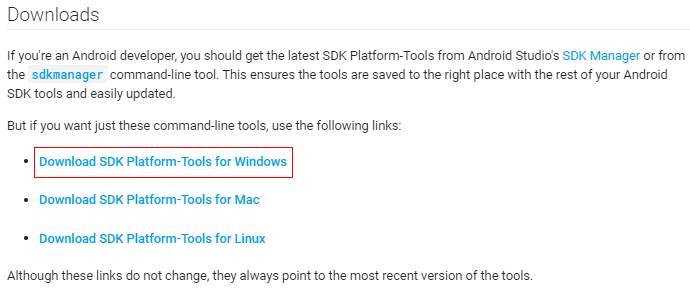

# ADB方式（内网）<a name="cph_ug_0004"></a>

通过内网连接云手机实例时，需要在租户VPC中创建一台弹性云服务器，作为连接云手机的跳板机器。若创建云手机服务器时未使用自定义网络，还需在云手机租户的VPC和服务器所在VPC之间建立对等连接，如[图1](#fig13212113195515)所示。云服务器的操作系统可以为Windows或Linux，本节操作以Linux系统为例。

**图 1**  ADB内网连接云手机<a name="fig13212113195515"></a>  


## 约束与限制<a name="section14265334301"></a>

-   租户VPC指的是云手机租户的VPC，其他租户的VPC不支持与服务器所在VPC建立对等连接。例如，[图1](#fig13212113195515)中，租户VPC和服务器所在VPC同属账号A，不能跨账号建立对等连接。
-   建立对等连接的租户VPC网段不能与172.31.0.0/16、10.237.0.0/16网段重叠，否则所建立的对等连接可能无效。
-   若租户VPC与云手机服务器所在VPC之间建立了多个对等连接，那么只有其中一个对等连接会被自动接受。

## 前提条件<a name="section175198511198"></a>

-   云手机实例状态必须为“运行中”。
-   请确保租户VPC已放通将要访问的云手机IP地址和端口的安全组入方向规则。

    云手机IP地址和端口获取方式：进入云手机详情页，在“应用端口”中获取“服务器监听地址”，如[图2](#fig11501470112)所示。

    **图 2**  应用端口<a name="fig11501470112"></a>  
    

-   租户VPC下已创建一台Linux系统的弹性云服务器。

## 步骤1：创建VPC对等连接（仅跳板机与云手机在不同VPC时需要）<a name="section106717010201"></a>

1.  登录管理控制台。
2.  在服务列表页，选择“计算 \> 云手机 CPH”。

    进入云手机页面。

3.  在左侧导航栏，选择“服务器管理”，在服务器列表上方，单击“路由配置”。
4.  <a name="li723016287235"></a>在右侧面板中，记录下“项目ID”、“VPC ID”和“VPC网段”的信息（建立VPC对等连接时需要使用）。

    **图 3**  信息收集<a name="fig399641022417"></a>  
    

5.  单击“对等连接”选项中的“前往控制台创建”。

    进入对等连接页面。

    > **说明：** 
    >如果当前存在“已接受”状态的对等连接，想要创建新的对等连接，请按以下方式进入对等连接页面：
    >1.  选择“服务列表 \> 网络 \> 虚拟私有云 VPC”。
    >2.  在左侧导航栏单击“对等连接”。

6.  单击右上角的“创建对等连接”。
7.  根据界面提示配置参数，其中“帐户”选择“其他帐户”，“对端项目ID”填写[4](#li723016287235)中记录的“项目ID”，“对端VPC ID”填写[4](#li723016287235)中记录的“VPC ID”。单击“确定”。

    **图 4**  创建对等连接<a name="fig125951210151919"></a>  
    

8.  等待5分钟左右，对等连接状态变为“已接受”。
9.  请参考“[添加VPC对等连接路由](https://support.huaweicloud.com/usermanual-vpc/zh-cn_topic_0046655038.html#section6)”为对等连接添加路由。某些区域的路由表未从对等连接模块解耦，可以参考“[添加VPC对等连接路由（路由表未解耦）](https://support.huaweicloud.com/usermanual-vpc/zh-cn_topic_0046655038.html#section5)”进行操作。

    添加路由时“目的地址”填写[4](#li723016287235)中记录的“VPC网段”。路由添加成功后，两个VPC就能够互通了。

10. （可选）如果需要将您租户下所有云手机的出网流量全部转发到所创建的对等连接上，请参考[路由配置](zh-cn_topic_0149245859.md)进行操作。

## 步骤2：通过ADB连接云手机<a name="section484861482114"></a>

1.  登录弹性云服务器。
2.  本地下载ADB工具并上传至云服务器。

    访问[https://developer.android.com/studio/releases/platform-tools](https://developer.android.com/studio/releases/platform-tools)，在页面右上角切换语言为“English”，选择“Download SDK Platform-Tools for Windows”。

    

    在弹出的对话框中勾选“I have read and agree with the above terms and conditions”，并单击“DOWNLOAD ANDROID SDK PLATFORM-TOOLS FOR WINDOWS”进行下载。

3.  解压ADB工具安装包（假设为platform-tools\_r29.0.5-windows.zip）至云服务器指定目录下（PATH）。
4.  进入“PATH\\platform-tools”目录。
5.  执行如下ADB命令连接云手机。

    **adb connect 服务器监听IP:服务器监听端口**

    服务器监听IP和服务器监听端口的获取方式如下：

    1.  在实例管理页面，单击待连接的云手机名称，进入详情页。
    2.  在“应用端口”区域获取服务器监听地址。

        **图 5**  应用端口<a name="fig1980993917368"></a>  
        

    以[图5](#fig1980993917368)中的信息为例，ADB命令为：**adb connect 172.31.248.213:4673**

6.  执行**adb devices**命令，检测当前端口是否已连接。

    回显如下类似信息，表示连接成功。

    ```
    List of devices attached
    172.31.248.213:4673  device
    ```

7.  执行相关ADB命令，开始操作云手机。

> **说明：** 
>ADB连接的故障排查，请参考如下链接：
>-   [ADB连接云手机时报错“unable to connect to :5555”？](https://support.huaweicloud.com/cph_faq/cph_faq_0024.html)
>-   [ADB连接突然中断，如何解决？](https://support.huaweicloud.com/cph_faq/cph_faq_0025.html)

## 相关操作<a name="section10755830436"></a>

-   [如何显示云手机画面？](https://support.huaweicloud.com/bestpractice-cph/cph_bp_0001.html)
-   [如何在单台云手机中安装APP？](https://support.huaweicloud.com/cph_faq/cph_faq_0013.html)

