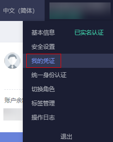
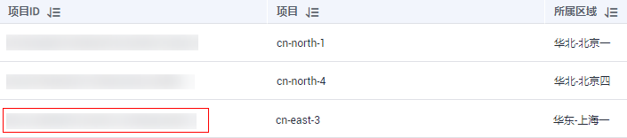
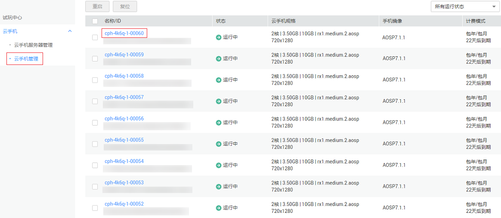
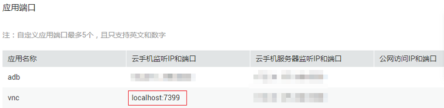
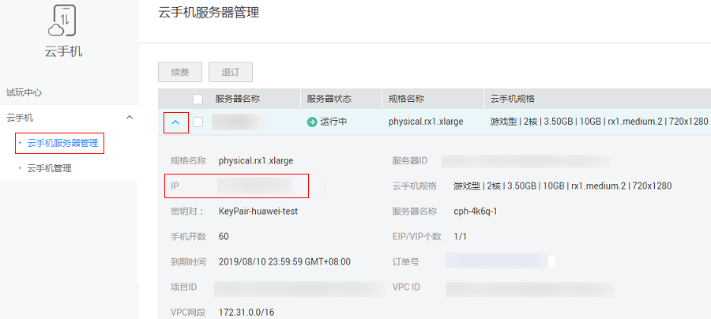

# VNC方式（公网）

通过公网连接云手机，此方式需要本地设备已安装VNC Viewer客户端。VNC方式连接（公网）包括两个步骤：建立SSH隧道；通过VNC客户端连接云手机。

本地设备的操作系统可以为Windows、Linux或Mac OS，本节操作以Windows系统为例。

## 约束与限制

-   云手机在购买时必须在高级配置中开启“VNC登录”，购买时无此配置项或者配置项未开启，均无法采用VNC方式连接。
-   试玩云手机不支持VNC方式。
-   部分云手机规格不支持VNC方式，如游戏型云手机。

    支持VNC方式的规格，以及如何判定现有的某台云手机是否支持VNC方式，请参见[支持VNC登录的云手机规格有哪些？](https://support.huaweicloud.com/cph_faq/cph_faq_0009.html)。

## 准备工作

建立SSH隧道前，用来连接云手机的本地设备需开通公网，并安装SSH客户端服务（比如OpenSSH）。您还需要登录云手机管理控制台，完成如下准备工作：

1.  获取云手机所在区域的项目ID。方法如下：
    1.  在右上角用户名的下拉列表中，选择“我的凭证”。

        

    2.  在“API凭证 \> 项目列表”中，获取待连接的云手机所在区域的“项目ID”。

        以“华东-上海一”为例：

        

        > **说明：**   
        >若项目ID位数多于32位，则取前32位作为建立SSH隧道的用户名。  

2.  选择一个本地设备中任意未被占用的端口，用来和云手机建立连接。

    您可以执行**netstat -an**命令，查看端口占用情况：

    如下图，6667端口已被其他程序占用，而1234端口空闲。

    

3.  获取云手机VNC应用监听端口。方法如下：
    1.  在云手机控制台，选择左侧导航中的“云手机 \> 云手机管理”，单击待连接云手机的名称，进入云手机详情页面。

        

    2.  在“应用端口”区域获取VNC应用监听端口，如下图中的7399。

        

4.  获取云手机服务器的公网IP地址。方法如下：

    在云手机控制台，选择左侧导航中的“云手机 \> 云手机服务器管理”，单击图标，展开云手机服务器详情，获取“IP”参数的取值。

    

    > **说明：**   
    >如果有多台云手机服务器，请根据云手机名称来判断云手机所属服务器是哪一台。例如，云手机名称为cph-test-1-00001，那么对应的云手机服务器名称为cph-test-1。  

5.  获取云手机服务器的密钥对对应的私钥文件在本地的保存路径，即[购买云手机实例](购买云手机实例.md)步骤[7](购买云手机实例.md#li1875842514113)中创建密钥对时保存在本地的私钥文件路径，例如：C:\\Users\\Administrator\\Downloads\\KeyPair-a49c.pem。路径不区分大小写，推荐您使用全英文路径。

    > **说明：**   
    >如果云手机服务器的密钥对对应的私钥文件丢失，请参考[私钥文件丢失，怎么办？](https://support.huaweicloud.com/cph_faq/cph_faq_0010.html)。  

## 步骤1：建立SSH隧道

1.  在本地设备打开命令提示符窗口，以Windows 10操作系统为例，方法如下：

    同时按下“Win + R”，在打开的“运行”对话框中输入**cmd**，按“Enter”。

2.  执行以下命令，建立SSH隧道。

    **ssh -L 本地空闲端口:localhost:云手机监听端口 SSH隧道用户名@公网IP地址 -i 私钥文件路径 -Nf**

    各参数说明及获取方式如下所述：

    -   **本地空闲端口**：用户自由选择的本地设备中任意未被占用的端口，通过该端口映射云手机应用端口。获取方式见[2](#li918704218111)。
    -   **云手机监听端口**：云手机VNC应用监听端口。获取方式见[3](#li827525992514)。
    -   **SSH隧道用户名**：云手机所在区域的项目ID。获取方式见[1](#li292753322516)。
    -   **公网IP地址**：云手机服务器的公网IP。获取方式见[4](#li12571818103710)。
    -   **私钥文件路径**：云手机服务器的密钥对对应的私钥文件在本地的保存路径。获取方式见[5](#li5745145662516)。

    假设本地空闲端口为1234，云手机监听端口为7399，SSH隧道用户名为05e1aexxx，公网IP地址为xxx.xxx.xxx.xxx，私钥文件路径为C:\\Users\\Administrator\\Downloads\\KeyPair-a49c.pem，命令如下：

    **ssh -L 1234:localhost:7399 05e1aexxx@xxx.xxx.xxx.xxx -i C:\\Users\\Administrator\\Downloads\\KeyPair-a49c.pem -Nf**

    该命令表示从本地PC建立一个到云手机的SSH隧道，使用本地端口转发模式，监听本地PC的1234端口；访问本地PC的1234端口时，通信数据将会被转发到云手机的7399端口。

    执行命令后，SSH程序会在后台执行隧道的转发，执行后无报错即为SSH隧道建立成功。

    > **说明：**   
    >若执行命令后报“too open”错误，请参考[建立SSH隧道时报错“too open”？](https://support.huaweicloud.com/cph_faq/cph_faq_0008.html)处理。  

## 步骤2：通过VNC客户端连接云手机

使用VNC客户端连接云手机，如VNC Viewer。

> **说明：**   
>VNC Viewer下载地址：[https://www.realvnc.com/en/connect/download/viewer/](https://www.realvnc.com/en/connect/download/viewer/)  

根据VNC客户端使用方法，输入相关IP和端口号，即：127.0.0.1:_本地空闲端口_。

其中，_本地空闲端口_为[2](#zh-cn_topic_0140029186_li213212132583)中所选择的本地空闲端口。

