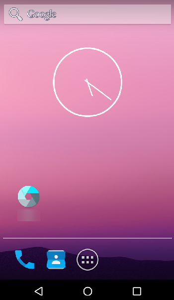

# VNC方式（内网）

通过内网连接云手机实例，在本地设备未安装VNC客户端或者客户端远程登录无法使用的情况下，可以采用此方式。

## 约束与限制

-   云手机在购买时必须在高级配置中开启“VNC登录”，购买时无此配置项或者配置项未开启，均无法采用VNC方式连接。
-   仅“rx1.cp.c60.d32.e1v1.qemu”规格的云手机支持VNC方式连接。

## 前提条件

云手机实例状态必须为“运行中”。

## 操作步骤

1.  登录管理控制台。
2.  在管理控制台左上角，选择待连接的云手机所在的区域。
3.  在服务列表页，选择“计算 \> 云手机 CPH”。

    进入云手机页面。

4.  单击左侧导航栏的“实例管理”。
5.  在云手机列表，选择一台云手机实例，单击右侧“操作”列的“远程登录”。

    > **说明：** 
    >仅“rx1.cp.c60.d32.e1v1.qemu”规格的云手机才能远程登录，其他规格无此按钮。

    进入云手机界面，可通过鼠标直接操作云手机。

    **图 1**  云手机界面  
    

