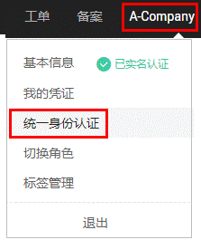
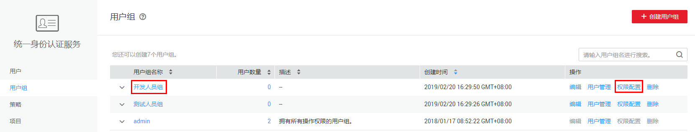
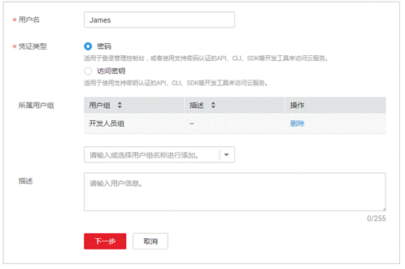
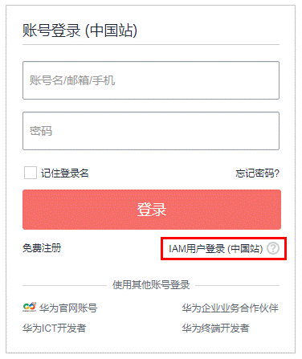

# 创建用户并授权使用CPH

本章节通过简单的用户组授权方法，将CPH的策略授予用户组，并将用户添加至用户组中，从而使用户拥有对应的CPH权限，操作流程如[图1](#zh-cn_topic_0173481716_zh-cn_topic_0172268189_fig12481104618719)所示。

**图 1**  给用户授权CPH权限流程  

1.  创建用户组并授权

    在IAM控制台创建用户组，并授予云手机服务权限“CPH Administrator”。

    该用户组仅拥有CPH Administrator权限时，只能执行对CPH的云手机服务器和云手机实例资源的操作，若需要其他云资源的管理权限，还需添加对应服务的权限策略。

2.  创建用户

    在IAM控制台创建用户，并将其加入[1](#zh-cn_topic_0173481716_zh-cn_topic_0172268189_li10269636890)中创建的用户组。

3.  用户登录并验证权限

    新创建的用户登录控制台，验证云手机服务的“CPH Administrator”权限。

## 前提条件

给用户组授权之前，请您了解用户组可以添加的CPH系统策略，并结合实际需求进行选择，云手机服务支持的系统策略，请参见[CPH系统策略](https://support.huaweicloud.com/productdesc-cph/cph_prod_0008.html)。若您需要对除CPH之外的其它服务授权，IAM支持服务的所有策略请参见[权限策略](https://support.huaweicloud.com/usermanual-permissions/zh-cn_topic_0063498930.html)。

## 步骤1：创建用户组并授权

用户组是用户的集合，IAM通过用户组功能实现用户的授权。您在IAM中创建的用户，需要加入特定用户组后，用户才具备用户组所拥有的权限。关于创建用户组并给用户组授权的方法，可以参考如下操作。

1.  使用注册的华为云账号登录华为云，登录时请选择“账号登录”。

    

2.  进入华为云控制台， 控制台页面中单击右上角的用户名，选择“统一身份认证”。

    

3.  在统一身份认证服务的左侧导航空格中，单击“用户组”\>“创建用户组”。

    

4.  在“创建用户组”界面，输入“用户组名称”，以“开发人员组”为例，单击“确定”。

    用户组创建完成，界面自动返回用户组列表，列表中显示新建的用户组。

5.  单击新建用户组右侧的“权限配置”，在“用户组权限”页签中，基于需要授权的区域，单击“设置策略”。

    CPH为项目级服务，请确认用户需要使用CPH资源的项目，然后在对应项目中设置权限，则用户仅能访问授权项目中的CPH资源，无法访问其他项目中的CPH资源。

    

    

6.  在“设置策略”中搜索“CPH”，选择“CPH Administrator”。CPH的系统策略说明，请参见[CPH系统策略](https://support.huaweicloud.com/productdesc-cph/cph_prod_0008.html)。
7.  单击“确定”，完成用户组授权。

## 步骤2：创建IAM用户

IAM用户与企业中的实际员工或是应用程序相对应，有唯一的安全凭证，可以通过加入一个或多个用户组来获得用户组的权限。关于IAM用户的创建方式请参见如下步骤。

> **说明：**   
>IAM用户没有权限访问云手机时，需要给IAM用户添加“Tenant Guest”策略，请参见[依赖权限的授权方法](https://support.huaweicloud.com/usermanual-iam/iam_01_0657.html)。  

1.  在统一身份认证服务，左侧导航中，单击“用户”\>“创建用户”。
2.  在“创建用户”界面中填写参数信息，完成后单击“下一步”。

    

    -   用户名：用户登录华为云的用户名，以“James”为例。
    -   凭证类型：凭证是指用户系统认证的身份凭证，以选择“密码”为例。
        -   密码：用户需要同时登录界面以及通过开发工具（API、CLI、SDK）访问华为云。
        -   访问密钥：用户仅需要通过开发工具访问华为云，不需要登录界面，凭证类型建议选择访问密钥，更加安全。

    -   所属用户组（可选）：选择新创建的用户组“开发人员组”。将用户加入用户组，用户将具备用户组的权限，这一过程即给该用户授权。其中“admin”为系统缺省提供的用户组，具有管理人员以及所有云服务资源的操作权限。
    -   描述（可选）：对用户的描述信息。

3.  在界面中填写参数信息，单击“确定”，完成用户创建。

    密码生成方式：

    -   首次登录时设置：如果您不是当前新建用户的使用主体，建议您选择该方式。用户通过邮件中的一次性链接登录华为云，自行设置密码。
    -   自动生成：此用户是通过开发工具访问华为云，建议您选择该方式，华为云将自动生成随机的10位密码。
    -   自定义：如果您是用户James的使用主体，建议您选择该方式，设置自己的登录密码。

## 步骤3：用户登录并验证权限

用户创建完成后，可以使用新用户的用户名及身份凭证登录华为云验证权限，即“CPH Administrator”权限。更多用户登录方法请参见[用户登录华为云方法](https://support.huaweicloud.com/qs-iam/iam_01_0031.html#section2)。

1.  在华为云登录页面，单击右下角的“IAM用户登录”。

    

2.  在“IAM用户登录”页面，输入账号名、用户名及用户密码，使用新创建的用户登录。

    -   账号名为该IAM用户所属华为云账号的名称。
    -   用户名和密码为账号在IAM创建用户时输入的用户名和密码。

    如果登录失败，您可以联系您的账号主体，确认用户名及密码是否正确，或是重置用户名及密码，重置方法请参见：[忘记IAM用户密码](https://support.huaweicloud.com/iam_faq/iam_01_0314.html#section1)。

3.  登录成功后，进入华为云控制台，登录后默认区域为“华北-北京一”，请先切换至授权区域。
4.  在“服务列表”中选择“云手机”，进入云手机服务，单击“购买云手机服务器实例”，若可以正常购买，表示“CPH Administrator”已生效。

## 创建自定义策略

如下以创建名为“CPH Administrator,秘钥对权限”的策略为例，创建一个可以有密钥对相关权限的自定义策略。

1.  在IAM控制台，单击左侧导航栏的“策略”，在右上角选择“创建自定义策略”。

    

2.  在“创建自定义策略”中，填写如下参数：

