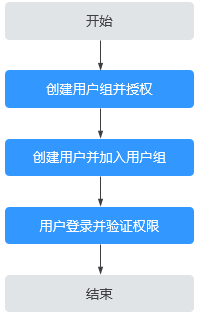

# 创建用户并授权使用CPH

如果您需要对您所拥有的云手机资源进行精细的权限管理，您可以使用[统一身份认证服务](https://support.huaweicloud.com/usermanual-iam/zh-cn_topic_0079496985.html)（Identity and Access Management，简称IAM）。通过IAM，您可以：

-   根据企业的业务组织，在您的华为云账号中，给企业中不同职能部门的员工创建IAM用户，让员工拥有唯一安全凭证，并使用云资源。
-   根据企业用户的职能，设置不同的访问权限，以达到用户之间的权限隔离。
-   将CPH资源委托给更专业、高效的其他华为云账号或者云服务，这些账号或者云服务可以根据权限进行代运维。

如果华为云账号已经能满足您的要求，不需要创建独立的IAM用户，您可以跳过本章节，不影响您使用CPH服务的其他功能。

本章节以授予“CPH User”权限为例，介绍为用户授权的方法，操作流程如[图1](#fig5293113815405)所示。

## 前提条件

给用户组授权之前，请您了解用户组可以添加的CPH系统权限，并结合实际需求进行选择，CPH支持的系统权限，请参见：[CPH权限管理](https://support.huaweicloud.com/productdesc-cph/cph_prod_0008.html)。若您需要对除CPH之外的其他服务授权，IAM支持服务的所有权限请参见：[系统权限](https://support.huaweicloud.com/usermanual-permissions/zh-cn_topic_0063498930.html)。

## 示例流程

**图 1**  给用户授予CPH权限流程  

1.  [创建用户组并授权](https://support.huaweicloud.com/usermanual-iam/zh-cn_topic_0046611269.html)

    在IAM控制台创建用户组，并授予云手机只读权限“CPH User”。

2.  [创建用户并加入用户组](https://support.huaweicloud.com/usermanual-iam/zh-cn_topic_0046611303.html)

    在IAM控制台创建用户，并将其加入[1](#zh-cn_topic_0173481716_zh-cn_topic_0172268189_li10269636890)中创建的用户组。

3.  [用户登录](https://support.huaweicloud.com/usermanual-iam/iam_01_0552.html)并验证权限

    新创建的用户登录控制台，切换至授权区域，验证权限（假设当前权限仅包含CPH User）。

    -   在“服务列表”中选择“计算 \> 云手机 CPH”，进入CPH主界面，在左侧导航栏选择“云手机 \> 云手机管理”尝试查看云手机数据。如果可以正常查看，表示“CPH User”已生效。
    -   在“服务列表”中选择“计算 \> 云手机 CPH”，进入CPH主界面，单击右上角“购买云手机服务器实例”尝试购买云手机服务器。若提示权限不足，表示“CPH User”已生效。
    -   在“服务列表”中选择除云手机服务外的任意一个服务，若提示权限不足，表示“CPH User”已生效。

