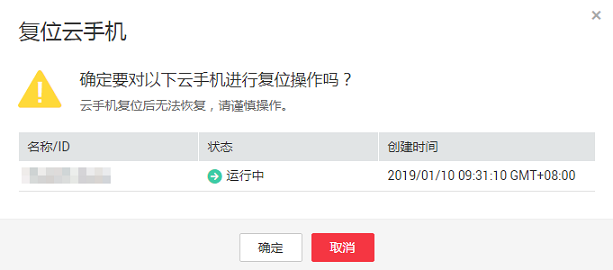

# 复位云手机实例

云手机复位指将手机的操作系统恢复到初始状态，手机产生的所有数据也会被删除。

> **须知：**   
>云手机复位后无法恢复，请谨慎操作。  

## 操作步骤

1.  登录管理控制台。
2.  在管理控制台左上角单击图标，选择区域和项目。
3.  在服务列表页，选择“计算 \> 云手机”。

    进入云手机页面。

4.  在左侧导航栏，选择“云手机 \> 云手机管理”。
5.  在云手机实例列表，
    -   选择一个需复位的云手机实例，单击右侧“操作”栏的“复位”。
    -   选择多个需复位的云手机实例，单击实例列表左上方的“复位”。

6.  在弹出框中，单击“确定”。

    **图 1**  确认复位  
    

    云手机实例的状态变更为“复位中”，表示执行复位操作成功。

