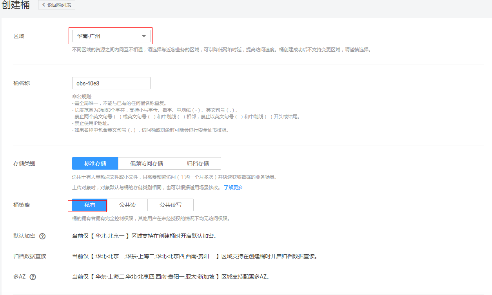
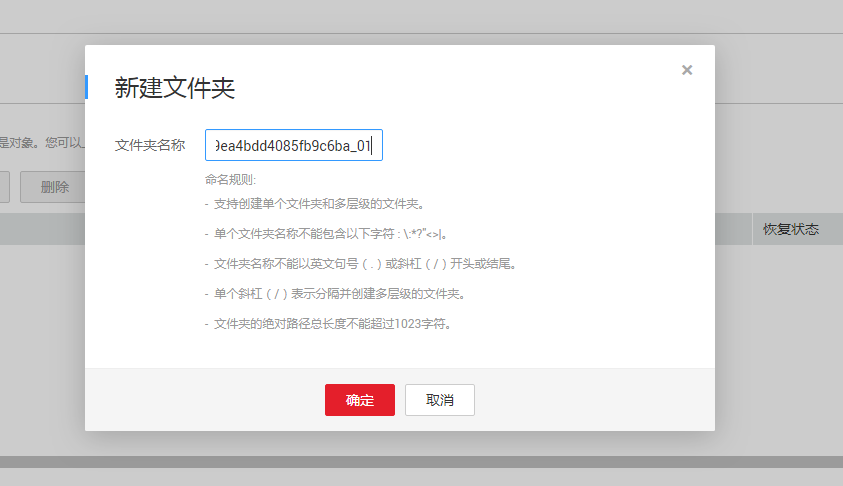
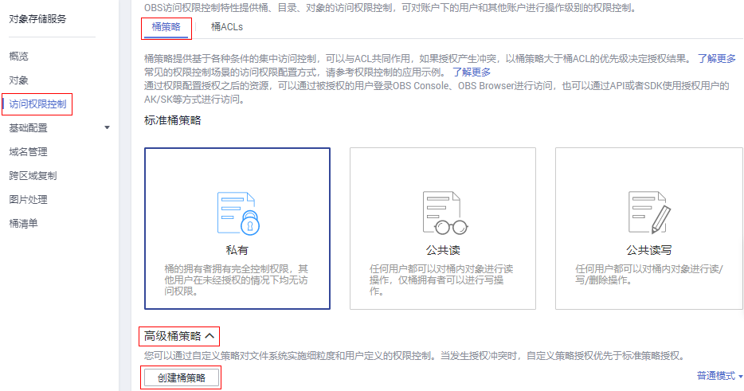
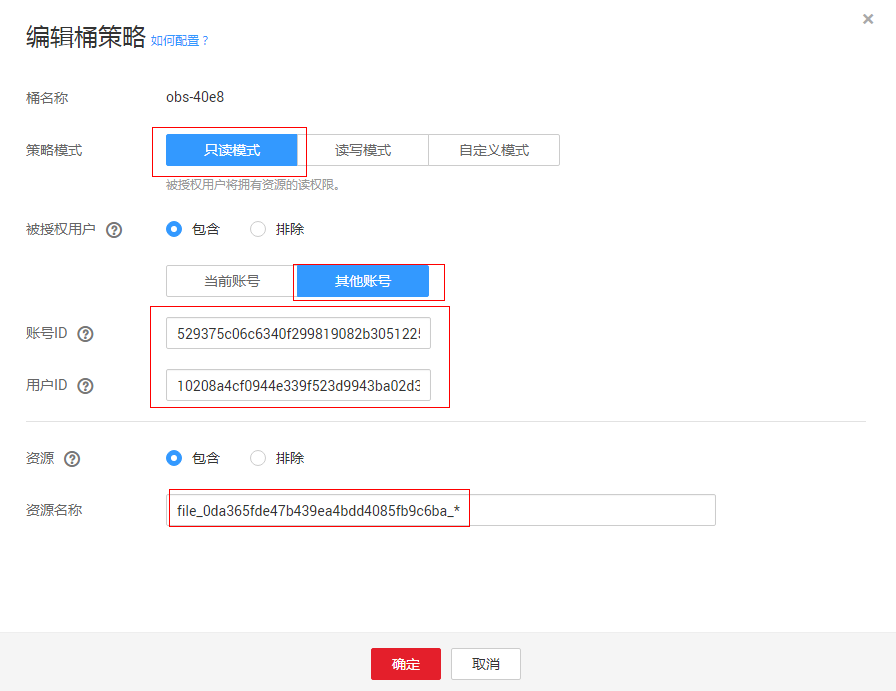

# 群控管理

## 操作场景

华为云CPH服务提供群控功能，群控功能可以通过群控管理API将OBS桶创建的安装文件等批量推送或安装到云手机中，便捷用户操作，提升管理效率。本章节通过群控安装APK的示例来介绍群控功能。

安装和更新APK有以下两种方式：

-   通过群控API执行install命令进行操作，详情请参考[安装apk](https://support.huaweicloud.com/api-cph/zh-cn_topic_0167640654.html)。
-   用户先将OBS桶里面的安装包，授权读取权限给云手机内置账号，通过文件推送的方式进行APK安装和热更新，详情请参考[推送文件](https://support.huaweicloud.com/api-cph/zh-cn_topic_0167640653.html)。

## 约束与限制

服务对群控风险与安全进行如下约束：

-   目前支持的群控命令:

    shell：在目标设备中启动远程交互式 shell。

    install：将软件包安装到系统。

    uninstall：从系统中移除软件包。

    push：将文件和目录从本地设备复制到设备上的远程位置。

-   群控命令数据和指令不当，会造成云手机故障和无法恢复。
-   如果需要执行install、push命令，则需要严格按照[操作步骤](#section65136523912)进行设置，并独立构建群控APK数据桶与其他数据隔离。
-   如果需要执行install、push命令，文件需要tar格式，压缩的文件路径按照AOSP（Android Open Source Project） 的目录结构放置。
-   同一台云手机服务器，文件推送任务耗时与文件推送任务个数成正比。

## 操作步骤

1.  登录管理控制台。
2.  在用户名的下拉列表中，单击“我的凭证”。
3.  在“项目列表”页签中查看项目ID。

1.  在OBS管理控制台左侧导航栏选择“对象存储”。
2.  在页面右上角单击“创建桶”，用于存放群控文件，如[图1](#fig189001919107)所示：

    **图 1**  创建群控使用的桶  
    

3.  选择“区域”、“存储类别”，并输入“桶名称”。

    **表 1**  创建桶

    
    <table><thead align="left"><tr id="row1975115459354"><th class="cellrowborder" valign="top" width="18.57%" id="mcps1.2.3.1.1">
参数

    </th>
    <th class="cellrowborder" valign="top" width="81.43%" id="mcps1.2.3.1.2">
说明

    </th>
    </tr>
    </thead>
    <tbody><tr id="row167511145133513"><td class="cellrowborder" valign="top" width="18.57%" headers="mcps1.2.3.1.1 ">
区域

    </td>
    <td class="cellrowborder" valign="top" width="81.43%" headers="mcps1.2.3.1.2 ">
选择云手机服务器所在区域。桶创建完成后，不支持修改该桶所在的区域。

    </td>
    </tr>
    <tr id="row1475124516351"><td class="cellrowborder" valign="top" width="18.57%" headers="mcps1.2.3.1.1 ">
桶名称

    </td>
    <td class="cellrowborder" valign="top" width="81.43%" headers="mcps1.2.3.1.2 ">
OBS中桶按照DNS规范进行命名，DNS规范为全球通用规则，其具体命名规则如下：

    <ul id="ul124356434362"><li>需全局唯一，不能与已有的任何桶名称重复。</li><li>长度范围为3到63个字符，支持小写字母、数字、中划线（-）、英文句号（.）。</li><li>禁止两个英文句号（.）或英文句号（.）和中划线（-）相邻，禁止以英文句号（.）和中划线（-）开头或结尾。</li><li>禁止使用IP地址。</li><li>如果名称中包含英文句号（.），访问桶或对象时可能会进行安全证书校验。</li></ul>
    </td>
    </tr>
    <tr id="row8718816364"><td class="cellrowborder" valign="top" width="18.57%" headers="mcps1.2.3.1.1 ">
存储类别

    </td>
    <td class="cellrowborder" valign="top" width="81.43%" headers="mcps1.2.3.1.2 ">
选择标准存储。

    <ul id="ul0435154314364"><li>标准存储：适用于有大量热点文件或小文件，且需要频繁访问（平均一个月多次）并快速获取数据的业务场景。</li><li>低频访问存储：适用于不频繁访问（平均一年少于12次），但需要快速获取数据的业务场景。</li><li>归档存储：适用于很少访问（平均一年一次），且对数据获取速率要求不高的业务场景。</li></ul>
    </td>
    </tr>
    </tbody>
    </table>

    > **说明：**   
    >-   由于通过URL访问桶时，桶名会作为URL的一部分，根据DNS命名标准，URL不支持大写字母，无法区分带大写字母的桶。因此，“桶名称”仅支持小写字母、数字、“-”、“.”作为桶的命名规则。例如：若想通过URL访问名为“MyBucket”的桶，该URL将解析成名为“mybucket”的桶，导致访问出错。  
    >-   DNS命名标准方便全局统一，方便在访问桶时对桶进行解析，可以使客户受益于新功能和优化性能，并支持对桶进行静态网站托管。  
    >-   桶创建成功后，不能修改名称，创建时，请设置合适的桶名。  

1.  单击“立即创建”。
2.  创建成功后单击创建的桶名，选择“对象 \> 创建文件夹”。
3.  创建file\_\{project\_id\}\_01命名的文件夹，在file\_\{project\_id\}\_01目录下存放群控文件，其中\{project\_id\}用你真实的项目ID代替，如[图2](#fig1927441612118)所示：

    **图 2**  创建群控的文件夹file\_\{project\_id\}\_01  
    

    > **说明：**   
    >-   如果云手机多，可以建立多个群控文件夹分开做源，提升性能，如file\_\{project\_id\}\_01，file\_\{project\_id\}\_02。  
    >-   建议群控文件夹以时间戳或者功能命名方便群控包的管理，例如file\_\{project\_id\}\_01/20180506122012/xxxx.tar。  
    >-   如果拥有数十万台云手机，建议用户基于OBS服务研发APP应用市场，实现APK安装与升级。  

1.  选择“权限 \> 桶策略 \> 高级桶策略 \> 创建桶策略”设置桶的策略，授权云手机内置账号下载资源file\_\{project\_id\}\_的权限，如下[图3](#fig12109157111615)所示：

    **图 3**  设置高级桶策略  
    

2.  给云手机服务系统账号授权OBS桶的只读权限，以便云手机通过群控管理API来实现文件的推送和安装，如[图4](#fig193141743201611)所示。
    1.  “策略模式”选择“只读模式”。
    2.  “被授权用户”选择“其他账号”。
    3.  输入云手机服务系统账号。

        > **须知：**   
        >云手机内置账号必填，信息如下：  
        >账号ID：529375c06c6340f299819082b3051225  
        >用户ID：10208a4cf0944e339f523d9943ba02d3  

    4.  输入资源名称file\_\{project\_id\}\_\*。

        **图 4**  编辑桶策略  
        

1.  在file\_\{project\_id\}\_01文件夹下面放置需要安装的tar包，调用群控api接口测试一台云手机，验证是否授权成功。

