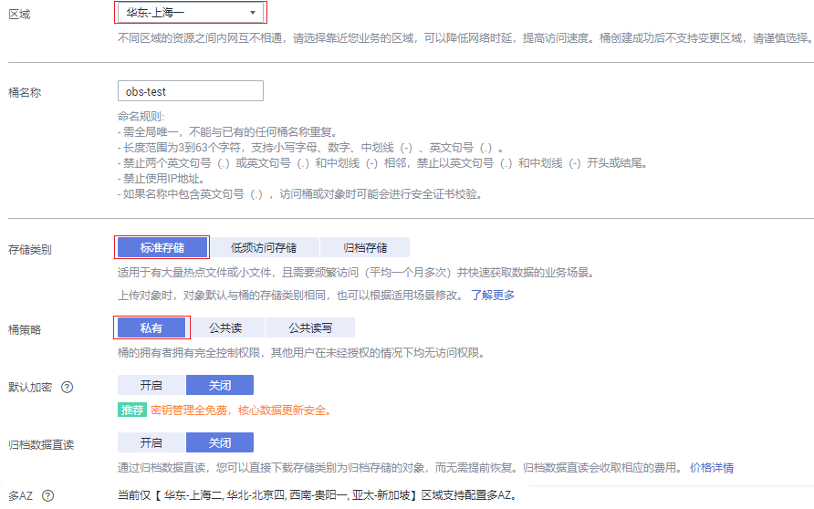
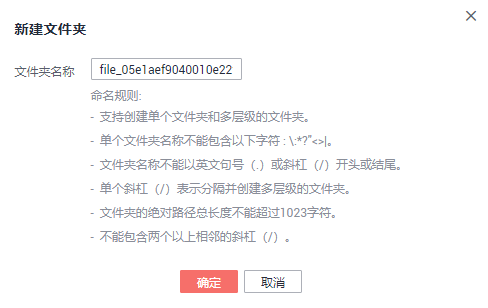

# 群控管理

## 操作场景

华为云CPH服务提供群控功能，群控功能可以通过群控管理API将存放在OBS桶中的APK安装文件等，批量推送或安装到云手机中，便捷用户操作，提升管理效率。本章节通过群控安装APK的示例来介绍群控功能。

安装和更新APK有以下两种方式：

-   通过群控API执行install命令进行操作，详情请参考[安装apk](https://support.huaweicloud.com/api-cph/zh-cn_topic_0167640654.html)。
-   用户先将OBS桶中的安装包，授予读取权限给云手机内置账号，通过文件推送的方式进行APK安装和热更新，详情请参考[推送文件](https://support.huaweicloud.com/api-cph/zh-cn_topic_0167640653.html)。

## 约束与限制

CPH服务对群控风险与安全进行如下约束：

-   目前支持的群控命令：

    shell：在云手机设备中启动远程交互式shell。

    install：将软件包安装到云手机系统。

    uninstall：从云手机系统中移除软件包。

    push：将文件或者文件夹从本地设备复制到云手机设备上。

-   群控命令数据和指令不当，会造成云手机故障并无法恢复。
-   如果需要执行install、push命令，则需要严格按照[操作步骤](#section65136523912)进行设置，并独立构建群控APK数据桶与其他数据隔离。
-   如果需要执行install、push命令，文件必须为tar格式，压缩的文件路径按照AOSP（Android Open Source Project）的目录结构放置。
-   同一台云手机服务器，文件推送任务耗时与文件推送任务个数成正比。

## 操作步骤

以下步骤主要演示如何创建用来存放群控文件的桶，以及如何为桶设置相关权限。安装和更新APK的操作仅能通过调用API实现。

1.  登录管理控制台。

1.  在服务列表页，选择“存储 \> 对象存储服务 OBS”。

    进入对象存储服务页面。

2.  在页面右上角单击“创建桶”，用于存放群控文件，如[图1](#fig189001919107)所示。

    **图 1**  创建群控使用的桶  
    

    -   区域：请选择云手机服务器所在区域。桶创建完成后，不支持修改该桶所在的区域。
    -   存储类别：请选择“标准存储”。
    -   桶策略：请选择“私有”。

    其他参数请参考“[创建桶](https://support.huaweicloud.com/usermanual-obs/zh-cn_topic_0045829088.html)”进行设置。

1.  单击“立即创建”。

    等待桶创建成功。

2.  单击创建的桶名称，选择左侧导航栏的“对象”，单击“新建文件夹”。

    **图 2**  对象页面  
    

3.  创建以“file\_\{project\_id\}\_01”命名的文件夹，在“file\_\{project\_id\}\_01”目录下存放群控文件，如[图3](#fig1927441612118)所示。

    其中，\{project\_id\}为云手机服务器所在区域的项目ID，获取方式请参见[如何获取项目ID？](https://support.huaweicloud.com/cph_faq/cph_faq_0004.html)。

    **图 3**  创建群控的文件夹file\_\{project\_id\}\_01  
    

    > **说明：**   
    >-   如果云手机数量较多，可以建立多个群控文件夹分开做源，提升性能，如file\_\{project\_id\}\_01、file\_\{project\_id\}\_02。  
    >-   建议群控文件夹以时间戳或者功能命名，方便群控包的管理，例如file\_\{project\_id\}\_01/20190506122012/xxxx.tar。  
    >-   如果拥有数十万台云手机，建议用户基于OBS服务研发APP应用市场，实现APK安装与升级。  

1.  选择左侧导航栏的“访问权限控制”，在“桶策略”页签中单击图标展开高级桶策略，单击“创建桶策略”设置桶的策略。

    **图 4**  设置高级桶策略  
    

2.  为云手机内置账号授予OBS桶的只读权限，以及下载资源“file\_\{project\_id\}\_\*”的权限，以便云手机通过群控管理API来实现文件的推送和安装，如[图5](#fig1528495418383)所示。

    其中，\{project\_id\}为云手机服务器所在区域的项目ID。

    **图 5**  创建桶策略  
    

    -   “策略模式”选择“只读模式”。
    -   “被授权用户”选择“其他账号”。
    -   输入云手机内置账号。

        > **须知：**   
        >云手机内置账号必填，信息如下：  
        >账号ID：529375c06c6340f299819082b3051225  
        >用户ID：10208a4cf0944e339f523d9943ba02d3  

    -   输入资源名称file\_\{project\_id\}\_\*。

1.  在“file\_\{project\_id\}\_01”文件夹下面放置需要安装的tar包，调用群控API测试一台云手机，验证是否授权成功。

