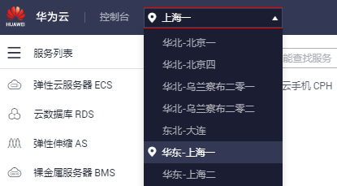

# 购买云手机实例

## 操作场景

云手机实例是通过购买云手机服务器后，系统自动创建的。本章节将为您详细介绍购买云手机服务器的操作步骤。云手机试玩流程请参见“[试玩云手机](https://support.huaweicloud.com/qs-cph/cph_qs_0002.html)”。

> **说明：**   
>若使用IAM用户访问云手机控制台时，提示权限不足，需要给IAM用户添加“Tenant Guest”角色，请参见[依赖角色的授权方法](https://support.huaweicloud.com/usermanual-iam/iam_01_0657.html)。  

## 前提条件

云手机目前还处于公测阶段，请确保您已申请公测。详细操作请参见“[申请公测](https://support.huaweicloud.com/qs-cph/cph_qs_0003.html#section14999155933911)”。

## 操作步骤

1.  登录管理控制台。
2.  在管理控制台左上角，选择一个靠近您业务的区域，可减少网络时延。

    **图 1**  选择区域  
    

3.  在服务列表页，选择“计算 \> 云手机 CPH”。
4.  在云手机控制台任意一个页面，单击右上角的“购买云手机服务器实例”。
5.  根据界面提示，完成基础配置，如[表1](#table1917663412211)。

    **表 1**  参数说明

    
    <table><thead align="left"><tr id="row201761434112119"><th class="cellrowborder" valign="top" width="20.262026202620262%" id="mcps1.2.4.1.1">
参数

    </th>
    <th class="cellrowborder" valign="top" width="44.49444944494449%" id="mcps1.2.4.1.2">
参数说明

    </th>
    <th class="cellrowborder" valign="top" width="35.24352435243524%" id="mcps1.2.4.1.3">
样例

    </th>
    </tr>
    </thead>
    <tbody><tr id="row15177143412110"><td class="cellrowborder" valign="top" width="20.262026202620262%" headers="mcps1.2.4.1.1 ">
计费模式

    </td>
    <td class="cellrowborder" valign="top" width="44.49444944494449%" headers="mcps1.2.4.1.2 ">
必选参数。

    
云手机服务器仅支持一种计费类型：包年/包月。

    </td>
    <td class="cellrowborder" valign="top" width="35.24352435243524%" headers="mcps1.2.4.1.3 ">
包年/包月

    </td>
    </tr>
    <tr id="row12177034142114"><td class="cellrowborder" valign="top" width="20.262026202620262%" headers="mcps1.2.4.1.1 ">
云手机服务器规格

    </td>
    <td class="cellrowborder" valign="top" width="44.49444944494449%" headers="mcps1.2.4.1.2 ">
必选参数。

    
云手机服务器当前只有一种规格：physical.rx1.xlarge。

    </td>
    <td class="cellrowborder" valign="top" width="35.24352435243524%" headers="mcps1.2.4.1.3 ">
physical.rx1.xlarge

    </td>
    </tr>
    <tr id="row6115133823413"><td class="cellrowborder" valign="top" width="20.262026202620262%" headers="mcps1.2.4.1.1 ">
云手机规格

    </td>
    <td class="cellrowborder" valign="top" width="44.49444944494449%" headers="mcps1.2.4.1.2 ">
必选参数。

    
请根据业务场景进行选择。

    </td>
    <td class="cellrowborder" valign="top" width="35.24352435243524%" headers="mcps1.2.4.1.3 ">
托管型

    
rx1.medium.2

    </td>
    </tr>
    <tr id="row349316570351"><td class="cellrowborder" valign="top" width="20.262026202620262%" headers="mcps1.2.4.1.1 ">
手机镜像

    </td>
    <td class="cellrowborder" valign="top" width="44.49444944494449%" headers="mcps1.2.4.1.2 ">
必选参数。

    
云手机实例运行的操作系统，目前只支持Android系统，其他手机系统由于商业授权缘故，不能提供。

    </td>
    <td class="cellrowborder" valign="top" width="35.24352435243524%" headers="mcps1.2.4.1.3 ">
AOSP7.1.1

    </td>
    </tr>
    <tr id="row121323182818"><td class="cellrowborder" valign="top" width="20.262026202620262%" headers="mcps1.2.4.1.1 ">
购买量

    </td>
    <td class="cellrowborder" valign="top" width="44.49444944494449%" headers="mcps1.2.4.1.2 "><ul id="ul59682815310"><li>云手机服务器的数量，一次最多可购买10台云手机服务器。</li><li>购买时长：可选取的时间范围为1个月~3年。</li></ul>
    </td>
    <td class="cellrowborder" valign="top" width="35.24352435243524%" headers="mcps1.2.4.1.3 ">
云手机服务器数量：1

    
购买时长：6个月

    </td>
    </tr>
    </tbody>
    </table>

6.  单击“下一步：网络配置”。根据界面提示，完成网络配置。

    带宽类型分为两种，独享带宽的配置如[表2](#table13184115515915)，共享带宽如[表3](#table0962181611124)所示。

    **表 2**  独享带宽

    
    <table><thead align="left"><tr id="row71824558918"><th class="cellrowborder" valign="top" width="20.432043204320433%" id="mcps1.2.4.1.1">
参数

    </th>
    <th class="cellrowborder" valign="top" width="53.44534453445344%" id="mcps1.2.4.1.2">
参数说明

    </th>
    <th class="cellrowborder" valign="top" width="26.12261226122612%" id="mcps1.2.4.1.3">
样例

    </th>
    </tr>
    </thead>
    <tbody><tr id="row81828552093"><td class="cellrowborder" valign="top" width="20.432043204320433%" headers="mcps1.2.4.1.1 ">
带宽类型

    </td>
    <td class="cellrowborder" valign="top" width="53.44534453445344%" headers="mcps1.2.4.1.2 ">
必选参数。

    
独享带宽：用户购买的每一台云手机服务器所独立使用的网络带宽。

    </td>
    <td class="cellrowborder" valign="top" width="26.12261226122612%" headers="mcps1.2.4.1.3 ">
独享带宽

    </td>
    </tr>
    <tr id="row51841355595"><td class="cellrowborder" valign="top" width="20.432043204320433%" headers="mcps1.2.4.1.1 ">
计费方式

    </td>
    <td class="cellrowborder" valign="top" width="53.44534453445344%" headers="mcps1.2.4.1.2 ">
计费方式选定后无法修改。目前支持按流量计费。

    
按流量计费：指定带宽上限，按实际使用的出网流量（原指标为上行流量）计费，与使用时间无关。

    </td>
    <td class="cellrowborder" valign="top" width="26.12261226122612%" headers="mcps1.2.4.1.3 ">
按流量计费

    </td>
    </tr>
    <tr id="row10207154811122"><td class="cellrowborder" valign="top" width="20.432043204320433%" headers="mcps1.2.4.1.1 ">
带宽

    </td>
    <td class="cellrowborder" valign="top" width="53.44534453445344%" headers="mcps1.2.4.1.2 ">
指带宽上限。

    </td>
    <td class="cellrowborder" valign="top" width="26.12261226122612%" headers="mcps1.2.4.1.3 ">
2000Mbit/s

    </td>
    </tr>
    </tbody>
    </table>

    **表 3**  共享带宽

    
    <table><thead align="left"><tr id="row179639166121"><th class="cellrowborder" valign="top" width="19.55195519551955%" id="mcps1.2.4.1.1">
参数

    </th>
    <th class="cellrowborder" valign="top" width="54.45544554455445%" id="mcps1.2.4.1.2">
参数说明

    </th>
    <th class="cellrowborder" valign="top" width="25.992599259925996%" id="mcps1.2.4.1.3">
样例

    </th>
    </tr>
    </thead>
    <tbody><tr id="row79631516131210"><td class="cellrowborder" valign="top" width="19.55195519551955%" headers="mcps1.2.4.1.1 ">
带宽类型

    </td>
    <td class="cellrowborder" valign="top" width="54.45544554455445%" headers="mcps1.2.4.1.2 ">
必选参数

    
共享带宽：用户名下所有选择使用共享带宽的云手机服务器所共用的网络带宽。第一次选择使用共享带宽购买云手机服务器时自动创建。

    </td>
    <td class="cellrowborder" valign="top" width="25.992599259925996%" headers="mcps1.2.4.1.3 ">
共享带宽

    </td>
    </tr>
    <tr id="row11963316131217"><td class="cellrowborder" valign="top" width="19.55195519551955%" headers="mcps1.2.4.1.1 ">
带宽名称

    </td>
    <td class="cellrowborder" valign="top" width="54.45544554455445%" headers="mcps1.2.4.1.2 ">
在第一次使用共享带宽购买云手机服务器时，无需选择，后台自动创建。后续使用共享带宽购买云手机服务器时，则默认选择已有的共享带宽。

    </td>
    <td class="cellrowborder" valign="top" width="25.992599259925996%" headers="mcps1.2.4.1.3 ">
whole-bandwidth-xxxx

    </td>
    </tr>
    <tr id="row1857741121612"><td class="cellrowborder" valign="top" width="19.55195519551955%" headers="mcps1.2.4.1.1 ">
带宽

    </td>
    <td class="cellrowborder" valign="top" width="54.45544554455445%" headers="mcps1.2.4.1.2 ">
在第一次使用共享带宽购买云手机服务器时，带宽大小可设置。后续使用共享带宽购买云手机服务器时，将使用第一次设置的带宽。

    </td>
    <td class="cellrowborder" valign="top" width="25.992599259925996%" headers="mcps1.2.4.1.3 ">
100Mbit/s

    </td>
    </tr>
    </tbody>
    </table>

    > **说明：**   
    >-   独享带宽按流量使用情况计费，与使用时间无关。共享带宽按照带宽大小和使用时长计费。  
    >-   这里所配置的网络仅供云手机服务器使用，您无法在您VPC服务下看到云手机服务器使用的相关网络带宽信息。  

7.  单击“下一步：高级配置”。根据界面提示，完成高级配置，如[表4](#table119810130427)所示。

    **表 4**  参数说明

    
    <table><thead align="left"><tr id="row1198161315422"><th class="cellrowborder" valign="top" width="22.622262226222624%" id="mcps1.2.4.1.1">
参数

    </th>
    <th class="cellrowborder" valign="top" width="59.47594759475947%" id="mcps1.2.4.1.2">
参数说明

    </th>
    <th class="cellrowborder" valign="top" width="17.9017901790179%" id="mcps1.2.4.1.3">
样例

    </th>
    </tr>
    </thead>
    <tbody><tr id="row17198213124218"><td class="cellrowborder" valign="top" width="22.622262226222624%" headers="mcps1.2.4.1.1 ">
名称

    </td>
    <td class="cellrowborder" valign="top" width="59.47594759475947%" headers="mcps1.2.4.1.2 ">
必选参数。

    
为您购买的云手机服务器和云手机实例命名，名称不可重复。

    
命名规则：购买云手机服务器后，名称自动按序增加数字后缀；云手机服务器对应的云手机实例则自动按序增加5位数字后缀。

    
例如，您购买了1台云手机服务器，该服务器对应60台云手机，名称输入CPH。则，云手机服务器名称为CPH-1，云手机实例的名称为CPH-1-00001~CPH-1-00060。

    </td>
    <td class="cellrowborder" valign="top" width="17.9017901790179%" headers="mcps1.2.4.1.3 ">
CPH

    </td>
    </tr>
    <tr id="row181982139422"><td class="cellrowborder" valign="top" width="22.622262226222624%" headers="mcps1.2.4.1.1 ">
密钥对

    </td>
    <td class="cellrowborder" valign="top" width="59.47594759475947%" headers="mcps1.2.4.1.2 ">
必选参数。

    
使用密钥对（Key Pair）进行远程登录身份验证。

    <ul id="ul493915191558"><li>如果您已经创建过密钥对，并且本地已妥善保存私钥文件（.pem格式），可以在下拉列表选择已有密钥对。</li><li>如果您从未创建过密钥对，请单击“新建密钥对”，跳转至云服务器控制台进行新建。然后返回该页面，刷新下拉列表，选择创建好的密钥对。
私钥用于远程登录身份认证，为保证安全，私钥文件（.pem格式）只能下载一次，请妥善保管。更多关于密钥对的介绍请参见“<a href="https://support.huaweicloud.com/usermanual-ecs/zh-cn_topic_0014250631.html" target="_blank" rel="noopener noreferrer">创建密钥对</a>”。

    </li></ul>
    </td>
    <td class="cellrowborder" valign="top" width="17.9017901790179%" headers="mcps1.2.4.1.3 ">
KeyPair-test

    </td>
    </tr>
    <tr id="row2018553413811"><td class="cellrowborder" valign="top" width="22.622262226222624%" headers="mcps1.2.4.1.1 ">
VNC登录

    </td>
    <td class="cellrowborder" valign="top" width="59.47594759475947%" headers="mcps1.2.4.1.2 ">
开启后，可通过VNC的方式连接云手机。

    
 说明： 

部分云手机规格不支持此功能，支持的规格请参见<a href="https://support.huaweicloud.com/cph_faq/cph_faq_0009.html" target="_blank" rel="noopener noreferrer">支持VNC登录的云手机规格有哪些？</a>。

    

    </td>
    <td class="cellrowborder" valign="top" width="17.9017901790179%" headers="mcps1.2.4.1.3 ">
-

    </td>
    </tr>
    <tr id="row1819921311425"><td class="cellrowborder" valign="top" width="22.622262226222624%" headers="mcps1.2.4.1.1 ">
高级配置

    </td>
    <td class="cellrowborder" valign="top" width="59.47594759475947%" headers="mcps1.2.4.1.2 ">
可选参数，根据您的需求选择是否配置。

    </td>
    <td class="cellrowborder" valign="top" width="17.9017901790179%" headers="mcps1.2.4.1.3 ">
-

    </td>
    </tr>
    <tr id="row17199181313422"><td class="cellrowborder" valign="top" width="22.622262226222624%" headers="mcps1.2.4.1.1 ">
应用端口

    </td>
    <td class="cellrowborder" valign="top" width="59.47594759475947%" headers="mcps1.2.4.1.2 ">
高级配置勾选“现在配置”时，需配置该参数。

    <ul id="ul16911021175812"><li>应用名称：支持大小写英文字母。不能为关键字“ADB”和“VNC”，大小写的任意组合都不行。</li><li>端口号：在10000~50000之间。</li><li>公网访问<ul id="ul4818132185917"><li>勾选时，表示可通过公网访问云手机该应用端口，即云手机对应的端口，以及相对应的服务器公网端口直接暴露在公网，无需鉴权即可互通。</li><li>不勾选时，表示只能通过租户的私有网络访问。</li></ul>
    
 注意： 
<ul id="ul15383161074817"><li>请谨慎勾选“公网访问”，确保在勾选前已做好安全控制。</li><li>云手机服务未对客户选择打开的端口做任何安全鉴权。</li></ul>
    

    </li></ul>
    </td>
    <td class="cellrowborder" valign="top" width="17.9017901790179%" headers="mcps1.2.4.1.3 ">
key

    
10001

    
不勾选

    </td>
    </tr>
    </tbody>
    </table>

8.  单击“下一步：确认订单”，您可再次核对信息。
    -   确认无误后，单击“立即购买”。
    -   如果还需要修改，单击“上一步”，修改参数。

9.  根据界面提示，完成支付。
10. 购买云手机服务器成功后，系统会自动创建好云手机。您可以在“云手机 \> 云手机服务器管理”页面查看云手机服务器的状态、IP等信息，在“云手机 \> 云手机管理”页面查看云手机状态、数量等信息。云手机数量取决于购买云手机服务器时所选择的云手机规格，假设规格中“手机开数”为60，则可创建的云手机数量为60台。

    云手机状态变为“运行中”时，表示云手机实例可使用。

## 后续操作

-   云手机购买成功后，您可能需要连接云手机，目前支持ADB连接和VNC连接两种方式。ADB方式是通用的连接方式，所有规格的云手机均支持；VNC方式受限于规格类型，支持的规格列表请参见[支持VNC登录的云手机规格有哪些？](https://support.huaweicloud.com/cph_faq/cph_faq_0009.html)。

    详细连接方式说明请参见[连接方式简介](连接方式简介.md)。

-   连接云手机后，您可能希望完成一些高阶功能，请参考如下链接：

    [通过Airtest快速获取云手机画面](https://support.huaweicloud.com/bestpractice-cph/zh-cn_topic_0193568653.html)

    [修改云手机的GPS定位信息](https://support.huaweicloud.com/bestpractice-cph/zh-cn_topic_0193371241.html)

