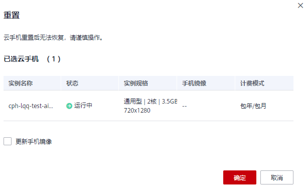

# 重置云手机实例

云手机重置指将云手机的操作系统恢复到初始状态，云手机产生的所有数据也会被删除。一般适用于云手机系统崩溃且无法恢复的场景。

> **注意：** 
>云手机重置后无法恢复，请谨慎操作。

## 操作步骤

1.  登录管理控制台。
2.  在管理控制台左上角，选择待操作云手机所在的区域。
3.  在服务列表页，选择“计算 \> 云手机 CPH”。

    进入云手机页面。

4.  单击左侧导航栏的“实例管理”。
5.  在云手机列表，
    -   选择一个需重置的云手机实例，单击右侧“操作”列的“重置”。
    -   选择多个需重置的云手机实例，单击实例列表左上方的“重置”。

6.  在右侧面板中，单击“确定”。

    **图 1**  确认重置  
    

    云手机实例的状态变为“重置中”，表示执行重置操作成功。

    > **说明：** 
    >您还可以勾选“更新手机镜像”，并输入镜像ID，来修改云手机的镜像。若同时勾选了多台云手机，可以实现批量修改云手机镜像的目的。

## 执行结果

云手机实例重置后，进入“运行中”状态。如果重置前云手机实例处于“关机”状态，重置后会自动开机。

## 相关API

[重置云手机](https://support.huaweicloud.com/api-cph/cph_api_0514.html)

